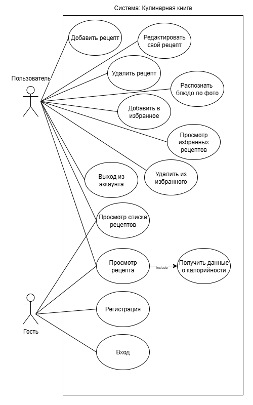
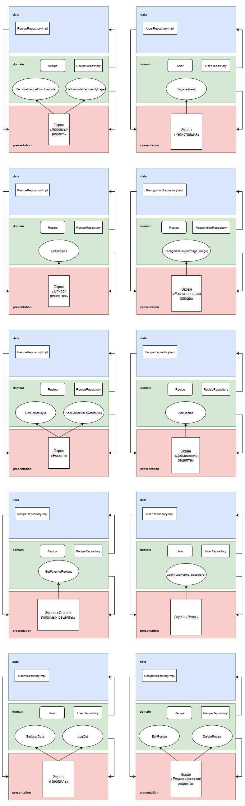
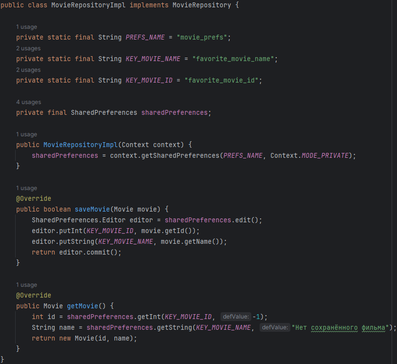
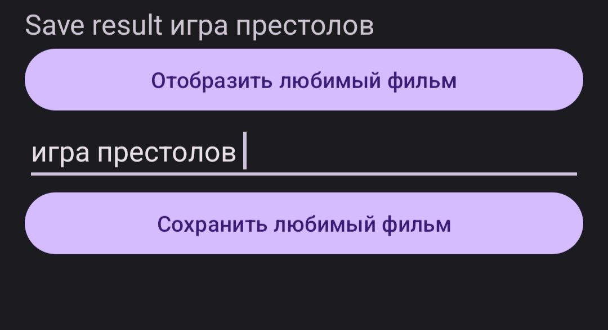
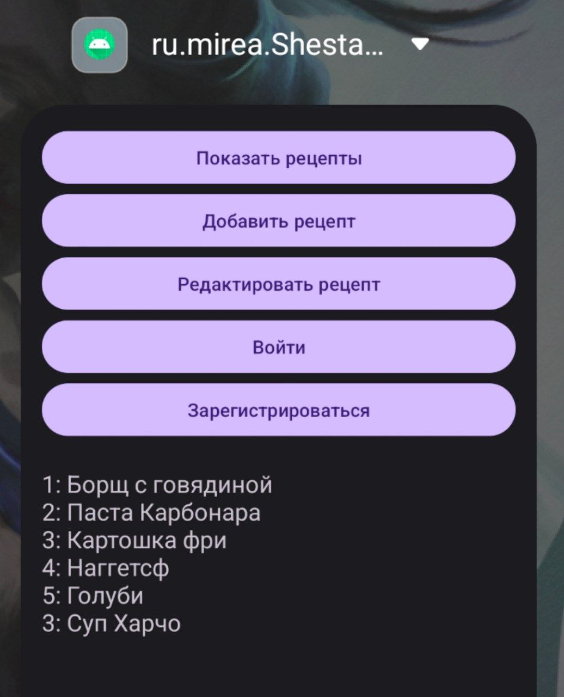

# Практическая работа №1

## Ход работы

### Use-Case диаграмма

Была создана Use-case диаграмма для приложения "Кулинарная книга".

Все пользователи могут регистрироваться, входить в систему и просматривать список рецептов, а авторизованные пользователи дополнительно могут добавлять и редактировать свои рецепты, добавлять блюда в избранное и распознавать блюда по фото.

### Разделение на слои и проектирование экранов

Были спроектированы экраны будущего приложения с разделением на зоны ответственности

### Механизм сохранения/получения информации о любимом фильме с помощью SharedPreferences

В приложении о фильмах была реализована возможность сохранять и выводить информацию с помощью SharedPreferences:

Так это выглядит в приложении:

### Реализация каркаса приложения

Далее был создан проект и основы для каждого слоя - модели, репозиторий use-cases.

Главная страница была пока что организована так. При нажатии на первую кнопку показываются рецепты, на вторую - добавляется новый рецепт, на третью - первый рецепт редактируется.

